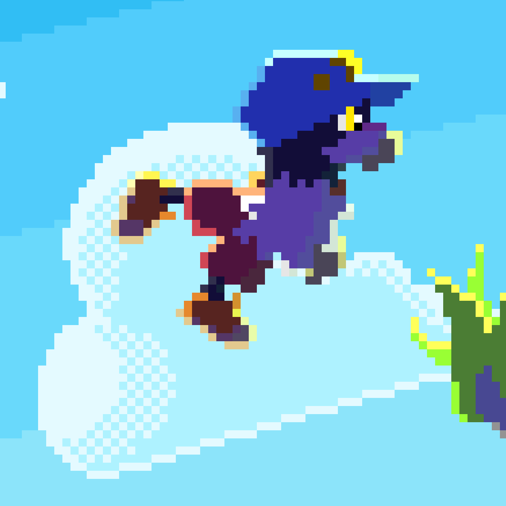
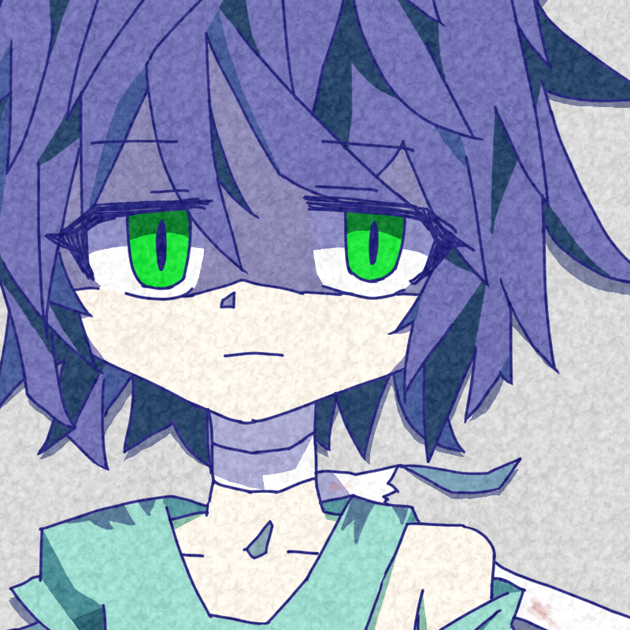

こんにちは

# お知らせ

### **[Lacuna/Draft(仮)](https://unityroom.com/games/lacunadraft)をやってくれ！！！！！！！！！**

# 基本情報

- 名前: いの / inonoa
- 所属: 京都大学総合人間学部 B4? (休学中) / [KMC (京大マイコンクラブ)](kmc.jp)
- アカウントその他
  - Twitter: [@not_hmr_but_ino](https://twitter.com/not_hmr_but_ino)
  - GitHub: [@inonoa](https://github.com/inonoa)
  - EMail: [(Gmail)](himura.kennsinn.degozaru@gmail.com)
  - はてなブログ: [@inonoa](http://inonoa.hatenablog.com/)

 etc.

# 応用情報

- 大体 Unity + C# 使い
- [AtCoderを一旦やめて半年がたった](https://atcoder.jp/users/inonoa)
  - 水色
  - C#er
- ハル研究所インターンシップ(プログラマのやつ)参加(2019年)

# 作ったもの

### [敵を避ける遊戯](https://github.com/inonoa/tekiwoyokerugame/releases/tag/2018.11)

- 2D(スクロールしない)アクション
  - 攻撃できないので敵を避け続けるのみ
- Python + [Pygame](https://www.pygame.org/) 製
- 音楽以外担当
 - BGM: [ぶ](https://twitter.com/bu_423)

### [ま釣り](https://unityroom.com/games/mafishing)

- サークル内ゲームジャムにて
- 「ま」と読める文字を釣る
- Unity製
- 企画？
  - といいつつ案だしたのは自分じゃなくない？

### [神集め](https://unityroom.com/games/kamiatsume)

- [#unity1week 「あつめる」](https://unityroom.com/unity1weeks/13)にて
- ひたすら神にぜんざいを振る舞う
- Unity製
- 個人開発

# 作っているもの

### [Lacuna/Draft(仮)](https://unityroom.com/games/lacunadraft)

- [敵を避ける遊戯](#敵を避ける遊戯)の拡張版
  - スクロールする
- Unity製
- 今のところ個人
  - 音楽どうしようかな……
